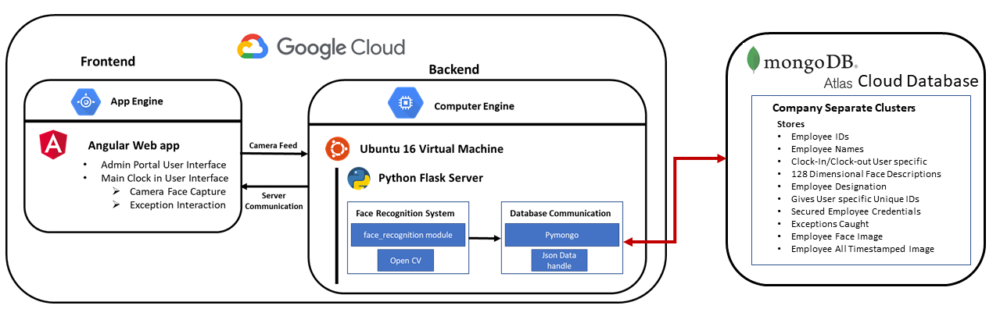

# TouchlessClockin_A2IL
Touchless clock-in system Designed and deployed a web based application in which uses face recognition with deep learning. Web application was built in Angular and deployed through Google Cloud Console with Python flask backend which also runs in a GCP Cloud Server. It uses Dlib leep learning library in python and Manages an unstructured database in cloud through MongoDB.



# Editable Updated Frontend Angular Files -
https://drive.google.com/file/d/1Fldkm1LpCxC5ZtlCFSqYoaFhfwXDdNE2/view?usp=sharing 

## Software Dependentcies
Google Cloud Console SDK - https://cloud.google.com/sdk/docs/install

Python3.7 with Flask and install dependencies from ```flask folder->requirements.txt```

## Cloud Access

Angular Frontend from GCP App Engine - https://touchless-281916.ue.r.appspot.com/

MongoDB Backend Database Link - 

Cloud Ubuntu Backend VNC server - 

## Recommended dlib python Instalation 
Download Source file from - https://github.com/davisking/dlib
### Before you can run the Python example programs you must compile dlib
```
python setup.py install
```


